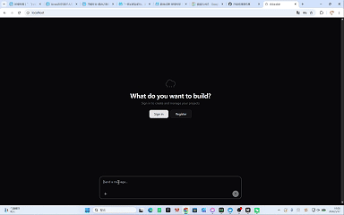

# CodeWiz — 一个端到端 AI 应用构建平台

<p align="center">
  <a href="https://github.com/codewiz/codewiz/stargazers"></a>
  <a href="https://github.com/codewiz/codewiz/network/members"></a>
  
  
</p>

<p align="center">
  
</p>

<p align="center">
  <em>左侧 AI 对话 · 右侧实时预览 · 底部终端 · 所见即所得</em>
</p>

<h3 align="center">
  描述你想要的应用 → AI 自动生成代码 → 实时预览运行效果
</h3>

<p align="center">
  <a href="#-快速启动"><strong>🚀 快速开始</strong></a>&nbsp;&nbsp;·&nbsp;
  <a href="#-核心功能"><strong>⚡ 功能演示</strong></a>&nbsp;&nbsp;·&nbsp;
  <a href="#-技术架构"><strong>🏗️ 技术架构</strong></a>&nbsp;&nbsp;·&nbsp;
  <a href="#-部署"><strong>🐳 一键部署</strong></a>&nbsp;&nbsp;·&nbsp;
  <a href="#-贡献"><strong>🤝 参与贡献</strong></a>
</p>

***

## 💡 是什么

CodeWiz 是一个**端到端 AI 应用构建平台**。你用自然语言描述需求，AI 自动分析、生成、运行完整的项目代码，并提供实时预览。

想象 Copilot Workspace + Vercel AI Agent + 沙箱执行环境的结合体 —— 但完全开源，可私有部署。

***

## ✨ 核心特性

### 🤖 14 种 AI 开发工具

AI Agent 不只写代码，还能自主执行完整开发流程：

| 工具                   | 功能        |
| -------------------- | --------- |
| `writeFileTool`      | 生成/覆盖代码文件 |
| `replaceInFileTool`  | 精准替换文件内容  |
| `readFileTool`       | 读取并理解现有代码 |
| `listFilesTool`      | 浏览项目结构    |
| `searchFilesTool`    | 全文搜索      |
| `makeDirectoryTool`  | 创建目录结构    |
| `movePathTool`       | 移动/重命名文件  |
| `deletePathTool`     | 删除文件或目录   |
| `bashTool`           | 执行任意终端命令  |
| `startDevServerTool` | 启动项目开发服务器 |
| `getPreviewUrlTool`  | 获取预览地址    |
| `checkAppTool`       | 检查应用健康状态  |
| `devServerLogsTool`  | 读取运行时日志   |
| `commitTool`         | 自动 Git 提交 |

### ⚡ 实时预览，所见即所得

代码改动后，AI 启动开发服务器，预览 iframe 实时显示运行效果。AI 生成的每一步都能立即验证。

### 🔒 安全沙箱隔离

每个项目运行在**独立进程**中：

- 确定性端口映射（同一项目始终映射到相同端口，重启不变）
- 进程级资源隔离
- 沙箱外无法访问宿主机

### 🐳 一键部署，一条命令启动全栈

```bash
docker compose up -d --build
# 5 个服务自动编排启动：
# Nginx (80/443) → Next.js (3000) → Go Backend (8080) → FastAPI AI (8000) → PostgreSQL (5432)
```

### 💬 流式对话 + Agent 执行循环

LLM 通过 **SSE 流式输出**，前端逐字渲染。Agent 循环：`LLM 思考 → 调用工具 → 读取结果 → 再次思考`，直到任务完成。

### 💾 多轮对话持久化记忆系统

基于 LangChain 原生实现的智能对话记忆，支持：
- 按 conversation_id 完全隔离存储
- 无网络依赖字符数经验估算 Token 数
- 自动智能窗口截断（超过 8000 Token / 50 条消息自动清理最老历史）
- 本地 JSON 持久化，服务重启记忆不丢失
- 完全兼容 LangChain BaseChatMessageHistory 接口标准

### 🔧 AI 服务预装 Node.js 18 LTS

AI 容器出厂预装 Node.js v18.20.4 和 npm v10.7.0，开箱即可 `npm install` 构建任意前端项目，无需额外安装。

### 🔒 安全沙箱加固

- 完全移除 shell=True 命令注入风险，改用 shlex.split 安全解析命令参数
- Windows 平台使用 taskkill /F /T 完整终止整个进程树，不留僵尸进程
- 所有 dev server / static server 日志自动持久化到项目目录 `.codewiz-logs/`，方便事后排查
- 跨平台沙箱目录自动适配：Windows %TEMP% 或 Linux /tmp

### 🔐 完整认证体系

JWT 全链路鉴权（注册 → 登录 → Token 生成 → 中间件验证 → AI 服务回调验证），覆盖所有 API。

***

## 🏗️ 技术架构

```
                         ┌──────────────────────────────────────────┐
                         │            Nginx (反向代理 / SSL)          │
                         │               端口 80 / 443                │
                         └────────────────────┬─────────────────────┘
                                              │
              ┌────────────────────────────────┼────────────────────────────────┐
              │                                │                                │
              ▼                                ▼                                ▼
    ┌──────────────────┐            ┌──────────────────┐            ┌──────────────────┐
    │     Frontend     │            │     Backend      │            │    AI Service    │
    │   Next.js 16     │            │    Go + Gin      │            │   FastAPI        │
    │   端口 3000      │            │   端口 8080      │            │   端口 8000      │
    │                  │            │                  │            │                  │
    │ • App Router    │            │ • JWT 鉴权       │            │ • SSE 流式响应   │
    │ • Tailwind 4    │            │ • REST API       │            │ • Agent 循环    │
    │ • Zustand       │            │ • GORM ORM       │            │ • 14 个工具      │
    │ • Vercel AI SDK │            │                  │            │ • 沙箱管理       │
    └────────┬─────────┘            └────────┬─────────┘            └────────┬─────────┘
             │                               │                               │
             └───────────────────────────────┼───────────────────────────────┘
                                             ▼
                                   ┌──────────────────────┐
                                   │     PostgreSQL       │
                                   │      端口 5432        │
                                   │   (GORM + JSONB)     │
                                   └──────────────────────┘
```

**三语言微服务**：TypeScript（前端）+ Go（高并发 API）+ Python（AI/ML 逻辑）

***

## 🚀 快速启动

### 环境要求

| 工具             | 版本     |
| -------------- | ------ |
| Docker         | 20.10+ |
| Docker Compose | 2.0+   |

### 一步启动

```bash
# 1. 克隆项目
git clone https://github.com/codewiz/codewiz.git
cd CodeWiz

# 2. 配置环境变量
cp .env.example .env
# 编辑 .env，填入以下关键配置：
#   - JWT_SECRET=<随机字符串>
#   - SILICON_FLOW_API_KEY=<硅基流动 API Key>
#   - POSTGRES_PASSWORD=<数据库密码>

# 3. 启动所有服务
docker compose up -d --build

# 4. 访问应用
open http://localhost
```

### 开发模式（手动启动）

```bash
# 终端 1 - Go 后端
cd backend && go run cmd/server/main.go

# 终端 2 - FastAPI AI 服务
cd ai-service && pip install -r requirements.txt && uvicorn app.main:app --reload

# 终端 3 - Next.js 前端
cd frontend && npm install && npm run dev
```

***

## 📁 项目结构

```
CodeWiz/
├── frontend/                 # Next.js 16 前端（端口 3000）
│   ├── app/                 # App Router 页面
│   │   ├── auth/            # 登录 / 注册
│   │   └── [repoId]/        # 项目工作区 + 实时预览
│   ├── components/           # assistant-ui 对话组件库
│   └── lib/                 # 认证上下文、项目上下文
│
├── backend/                 # Go + Gin 后端（端口 8080）
│   ├── cmd/server/          # 程序入口
│   ├── internal/
│   │   ├── handlers/        # HTTP 处理器（auth / repo / conversation）
│   │   ├── services/        # 业务逻辑层
│   │   ├── repositories/    # GORM 数据访问层
│   │   ├── middleware/     # JWT 鉴权中间件
│   │   └── models/          # 数据模型（User / Repo / Conversation / Message）
│   └── pkg/response/        # 统一 API 响应格式
│
├── ai-service/              # FastAPI AI 服务（端口 8000）
│   ├── app/
│   │   ├── api/            # chat（SSE） / conversation / auth / sandbox
│   │   ├── harness/
│   │   │   ├── agent.py   # Agent 执行循环
│   │   │   └── tools.py   # 14 个工具定义
│   │   ├── llm/            # 硅基流动 LLM 客户端
│   │   └── core/           # 配置、数据库、安全
│   └── tests/
│
├── nginx/                   # Nginx 反向代理配置
├── docker-compose.yml        # 容器编排
└── .env.example             # 环境变量模板
```

***

## 🧩 技术亮点

| 亮点                     | 说明                                     |
| ---------------------- | -------------------------------------- |
| **确定性端口映射**            | FNV-1a 哈希算法，同一项目始终映射到相同端口，重启不变         |
| **JSONB 工具调用记录**       | 数据库存储完整工具调用链，可回放 AI 的每一步操作             |
| **跨平台沙箱**              | Linux/macOS/Windows 全平台支持，沙箱根目录自动适配    |
| **JWT 双向验证**           | AI 服务回调 Backend 验证 Token，避免各语言 JWT 库差异 |
| **Next.js Standalone** | Docker 镜像只打包必要文件，体积最小化                 |
| **SSE 背压控制**           | 流式响应分块传输 + 背压控制，优化大响应延迟                |

***

## ⚙️ 配置说明

| 变量名                    | 必填     | 说明                                                |
| ---------------------- | ------ | ------------------------------------------------- |
| `POSTGRES_PASSWORD`    | ✅      | PostgreSQL 密码                                     |
| `JWT_SECRET`           | ✅      | JWT 签名密钥（生产环境请使用复杂随机字符串）                          |
| `SILICON_FLOW_API_KEY` | ✅      | 硅基流动 API Key（[获取地址](https://www.siliconflow.cn/)） |
| `DATABASE_URL`         | <br /> | PostgreSQL 连接地址（compose 中已自动填充）                   |
| `LLM_MODEL`            | <br /> | LLM 模型名，默认 `Qwen/Qwen2.5-7B-Instruct`             |

***

## 🔮 未来规划

- [ ] 支持 Anthropic Claude / OpenAI GPT 等更多 LLM 提供商
- [ ] 引入向量数据库，实现 RAG 知识增强
- [ ] WebSocket 双向实时通信
- [ ] 多租户隔离（企业版）
- [ ] 团队协作（多人实时编辑）
- [ ] 项目模板市场（React / Vue / Next.js 模板一键生成）

***

## 🤝 参与贡献

欢迎提交 Issue 和 Pull Request！

```bash
# 1. Fork 本仓库
# 2. 创建特性分支
git checkout -b feature/your-feature

# 3. 提交更改（使用 Conventional Commits）
git commit -m 'feat: add something amazing'

# 4. 推送分支
git push origin feature/your-feature

# 5. 创建 Pull Request
```

### 代码规范

- Go → [Go Code Review Comments](https://github.com/golang/go/wiki/CodeReviewComments)
- Python → [PEP 8](https://pep8.org/)
- TypeScript → ESLint + Prettier

***

## 📜 更新日志

- ✅ 用户认证体系（注册 / 登录 / JWT）
- ✅ 流式对话（SSE + Agent 执行循环）
- ✅ 14 个 AI 开发工具
- ✅ 实时预览（沙箱 + 预览 iframe）
- ✅ Docker Compose 一键部署
- ✅ 确定性沙箱端口映射
- ✅ GitHub 仓库导入
- ✅ **v1.1 新增**：多轮对话持久化记忆系统（基于 LangChain）
- ✅ **v1.1 新增**：Agent 完全异步化，工具调用在线程池执行不阻塞事件循环
- ✅ **v1.1 新增**：AI 服务预装 Node.js v18.20.4 + npm v10.7.0，开箱即用
- ✅ **v1.1 修复**：沙箱安全加固（完全移除 shell=True 命令注入风险，跨平台进程树终止，自动日志持久化）
- ✅ **v1.1 修复**：历史对话丢失 Bug（conversation_id 绑定持久化记忆）

***

## ❓ 常见问题

**Q: 如何获取硅基流动 API Key？**

> 访问 [siliconflow.cn](https://www.siliconflow.cn/)，注册后在控制台创建 API Key。

**Q: 支持哪些 LLM 模型？**

> 默认使用 Qwen2.5-7B-Instruct，可通过 `LLM_MODEL` 环境变量切换其他支持的模型。

**Q: 如何扩展新的工具？**

> 在 `ai-service/app/harness/tools.py` 中添加新的 `@tool` 装饰器函数即可。

**Q: 沙箱安全性如何保障？**

> 每个项目运行在独立进程中，端口由哈希算法分配，无法直接访问宿主机。

***

## 📄 License

MIT License - 详见 [LICENSE](LICENSE)。

***

<p align="center">
  <strong>如果这个项目对你有帮助，请给我们一个 ⭐</strong>
  <br><br>
  <a href="https://github.com/codewiz/codewiz/stargazers">
    
  </a>
  <a href="https://github.com/codewiz/codewiz/fork">
    
  </a>
</p>
