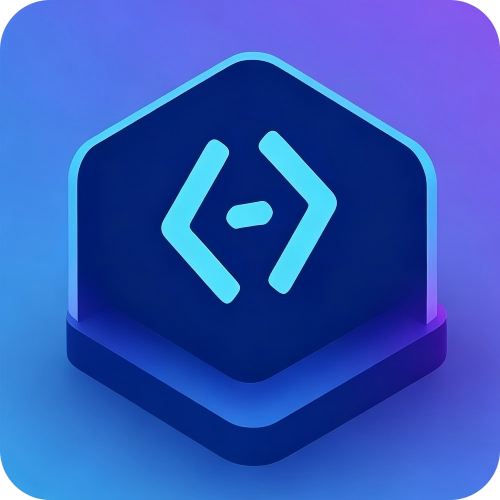

# CodeWiz

<p align="center">
  
</p>

**The AI Agent desktop client that puts you in control** -- connect any AI provider, extend with MCP & skills, automate tasks, and let your assistant learn your workflow.

---

## What is CodeWiz?

CodeWiz is a cross-platform desktop application that brings together every major AI provider under one roof. Whether you're using Claude, GPT, Gemini, DeepSeek, or a local model via Ollama, CodeWiz gives you a single, powerful interface to interact with all of them -- without losing your conversation history, context, or settings.

But CodeWiz goes beyond chat. It's a fully capable AI agent platform:

- **Multi-provider**: Switch models mid-conversation without losing context
- **Remote Bridge**: Control CodeWiz from Telegram, Feishu, Discord, QQ, or WeChat
- **MCP + Skills**: Extend capabilities with MCP servers and reusable skills
- **Task Scheduler**: Automate recurring AI tasks with cron expressions
- **Generative UI**: AI creates interactive dashboards and widgets rendered live in the app
- **Persistent Memory**: Your assistant learns your preferences and remembers context

---

## Download

| Platform | Installer | Architectures |
|---|---|---|
| macOS | [.dmg](https://github.com/imagist13/CodeWiz/releases/latest) | arm64 / x64 |
| Windows | [.exe](https://github.com/imagist13/CodeWiz/releases/latest) | x64 + arm64 |
| Linux | [AppImage](https://github.com/imagist13/CodeWiz/releases/latest) · [.deb](https://github.com/imagist13/CodeWiz/releases/latest) · [.rpm](https://github.com/imagist13/CodeWiz/releases/latest) | x64 + arm64 |

---

## Features at a Glance

### AI Providers (20+)

| Category | Providers |
|---|---|
| Direct API | Anthropic, Anthropic Third-party |
| Cloud | AWS Bedrock, Google Vertex AI |
| Chinese AI | Zhipu GLM, Kimi, Moonshot, MiniMax, DeepSeek, Volcengine Ark, Xiaomi MiMo, Aliyun Bailian |
| Open-source routing | OpenRouter |
| Local / Self-hosted | Ollama, LiteLLM |
| Media | Google Gemini (image generation) |

### Conversation & Interaction

- **Three modes**: Code, Plan, Ask
- **Reasoning control**: Low / Medium / High / Max + extended thinking
- **Session control**: Pause, resume, rewind to any checkpoint, archive
- **Split-screen**: Side-by-side dual sessions
- **Attachments**: Files and images with multimodal vision support
- **Slash commands**: `/help`, `/clear`, `/cost`, `/compact`, `/doctor`, `/review` and more
- **Integrated terminal**: Full terminal emulator inside the app
- **Git panel**: Status, branches, commits, worktree management

### Extensions & Integrations

- **MCP servers**: stdio / SSE / HTTP transport, runtime status monitoring
- **Skills**: Custom, project-level, and global skills with skills.sh marketplace
- **CLI tools**: Claude Code, Codex, O1, Gemini CLI, Cursor, Windsurf, Trae, Goose, Aider, Cline, Continue, Devin, Zed AI, Cody, Supermaven, Tabnine, v0, and more
- **Remote Bridge**: Telegram / Feishu / Discord / QQ / WeChat remote control
- **Image generation**: Gemini image gen with batch tasks and gallery
- **Claude Code CLI import**: Import your `.jsonl` session history

### Data & Workspace

- **Assistant Workspace**: Persona files (`soul.md`, `user.md`, `claude.md`, `memory.md`), onboarding flows, daily check-ins, persistent memory
- **Generative UI**: AI creates interactive dashboards and visual widgets rendered live in-app
- **File browser**: Project file tree with syntax-highlighted preview
- **Memory system**: Semantic indexing for long-term memory extraction, search, and retrieval
- **Usage analytics**: Token counts, cost estimates, daily usage charts
- **Task scheduler**: Cron-based and interval scheduling with persistence
- **Python runtime**: Execute Python code in sessions with a persistent interpreter
- **Local storage**: All data stored locally via SQLite (WAL mode) -- nothing leaves your machine
- **i18n**: English and Chinese interface
- **Themes**: Dark and light mode, one-click toggle

---

## Quick Start

### Download a Release

1. Download the installer for your platform from the [Download](#download) section
2. Launch CodeWiz
3. Go to **Settings > Providers** and add your API key
4. Start a conversation

### Build from Source

```bash
git clone https://github.com/imagist13/CodeWiz
cd CodeWiz

npm install
npm run dev              # browser mode at http://localhost:3000
# -- or --
npm run electron:dev     # full desktop app
```

**Prerequisites**: Node.js 18+ and npm 9+

> **Note**: Installing the [Claude Code CLI](https://docs.anthropic.com/en/docs/claude-code/overview) (`npm install -g @anthropic-ai/claude-code`) unlocks additional capabilities like file editing, terminal commands, and git operations. Recommended but not required for basic chat.

---

## Architecture

```
┌─────────────────────────────────────────────────────────┐
│                 Electron 40 (Desktop Shell)              │
│  ┌──────────────┐  ┌─────────────┐  ┌────────────────┐  │
│  │ Main Process │  │   Preload   │  │  Terminal Mgr  │  │
│  │  - IPC       │  │  - dialog   │  │  - PTY/ConPTY  │  │
│  │  - Tray      │  │  - bridge   │  │  - Shell spawn │  │
│  │  - Auto-update│ │  - notif    │  └────────────────┘  │
│  └──────────────┘  └─────────────┘                      │
└─────────────────────────────────────────────────────────┘
                              │ IPC
                              ▼
┌─────────────────────────────────────────────────────────┐
│               Next.js 16 (App Router)                   │
│  ┌──────────────┐  ┌──────────────┐  ┌───────────────┐  │
│  │ React 19 UI  │  │  30+ API     │  │ Claude Agent  │  │
│  │ Components   │◄─┤  Routes      ├─►│ SDK (SSE)     │  │
│  └──────────────┘  └──────────────┘  └───────┬───────┘  │
│                                              │           │
│  ┌──────────────────────────────────────────┼─────────┐  │
│  │              Core Library (src/lib/)      │         │  │
│  │  db.ts · claude-client.ts · provider-    │         │  │
│  │  catalog.ts · bridge/ · mcp-loader.ts   │         │  │
│  │  task-scheduler.ts · memory/            │         │  │
│  └──────────────────────────────────────────┼─────────┘  │
└─────────────────────────────────────────────┼────────────┘
                                              │
                                              ▼
                              ┌────────────────────────────┐
                              │   20+ AI Providers         │
                              │  Anthropic · OpenRouter    │
                              │  GLM · Kimi · DeepSeek     │
                              │  Ollama · Bedrock · etc.   │
                              └────────────────────────────┘
```

**Tech Stack**: Electron 40 · Next.js 16 · React 19 · Tailwind CSS 4 · Radix UI · Motion · better-sqlite3 · Claude Agent SDK · Shiki · CodeMirror 6

---

## Platform Notes

macOS builds are code-signed but not notarized. Windows and Linux builds are unsigned.

**macOS Gatekeeper**: Right-click the app > Open > confirm, or run `xattr -cr /Applications/CodeWiz.app` in Terminal.

**Windows SmartScreen**: Click "More info" on the SmartScreen dialog, then "Run anyway".

---

## Documentation

Full documentation is available at [CodePilot](https://github.com/op7418/CodePilot).

---

## License

> **Derivative Work Notice**: This project (CodeWiz) is a derivative work based on the open-source project [CodePilot](https://github.com/op7418/CodePilot), licensed under the BSL-1.1 license terms of the original project.

[Business Source License 1.1 (BSL-1.1)](LICENSE)

- Personal / academic / non-profit use: free and unrestricted
- Commercial use: requires a separate license
- Change date: 2029-03-16 -- after which the code converts to Apache 2.0
