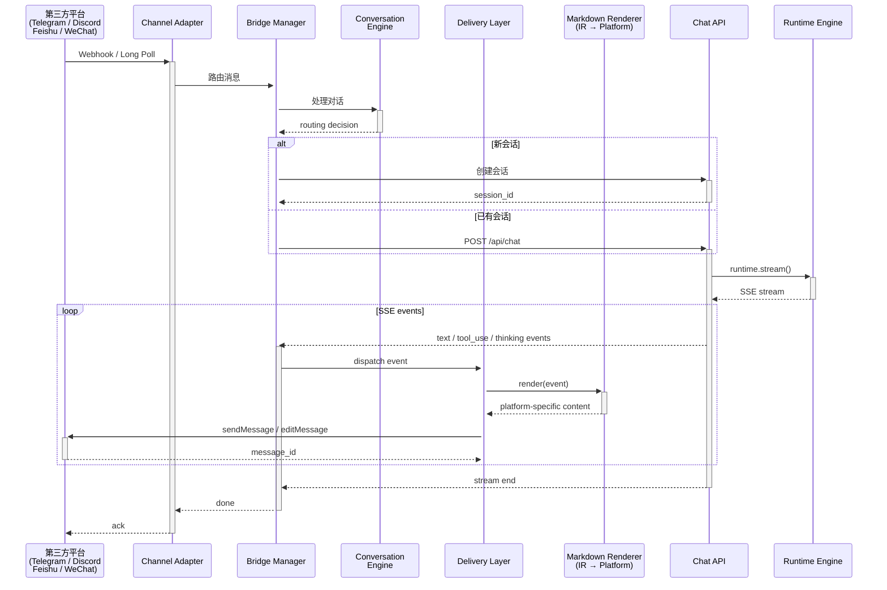
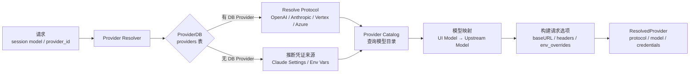
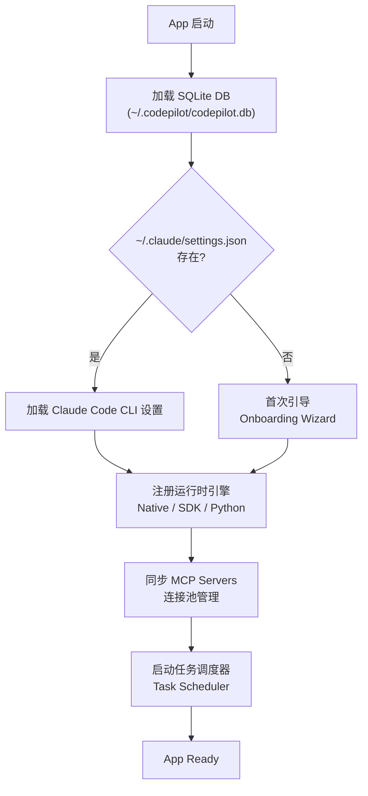
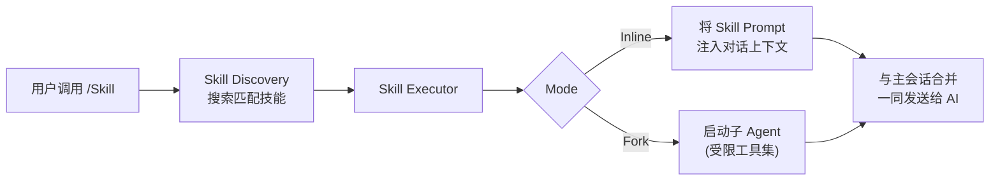
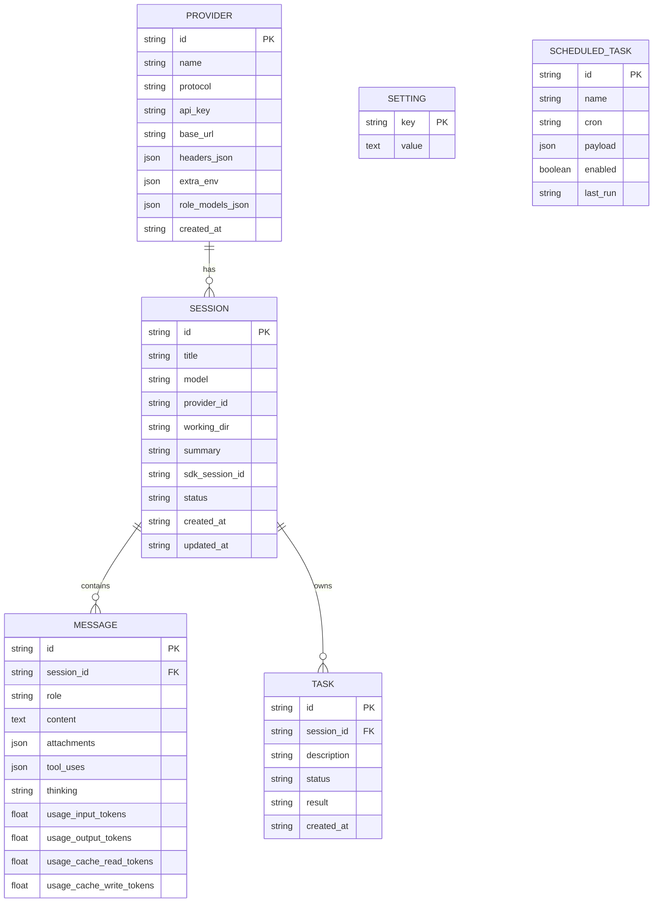

# CodeWiz 系统架构图 & 时序图

> 本文档使用 [Mermaid](https://mermaid.js.org/) 绘制，可在 VS Code / Cursor 等编辑器中预览，或粘贴至 [Mermaid Live Editor](https://mermaid.live)。

---

## 1. 系统架构图（Overview）

```mermaid
graph TB
    subgraph "Client Layer (Electron / Browser)"
        UI["React 19 UI\n(Next.js 16 App Router)"]
        State["Zustand / React State\n会话状态管理"]
        SSE["SSE Stream 渲染"]
    end

    subgraph "API Layer (Next.js API Routes)"
        ChatAPI["POST /api/chat\n对话入口"]
        SkillsAPI["GET/POST /api/skills\n技能管理"]
    end

    subgraph "Core Engine"
        subgraph "Runtime Engine (运行时引擎)"
            NativeRT["Native Runtime\n(AI SDK streamText)"]
            SDKRT["SDK Runtime\n(Claude Code CLI)"]
            PythonRT["Python Runtime\n(Claude Python SDK)"]
        end

        subgraph "Provider System (模型供给)"
            ProviderResolver["Provider Resolver\n统一解析层"]
            ProviderCatalog["Provider Catalog\n模型目录 & 协议推断"]
            ProviderDB["SQLite: providers\nproviders 表"]
        end

        subgraph "Tool System (工具系统)"
            Tools["内置工具集\nRead / Write / Edit / Bash\nGlob / Grep / Agent"]
            MCPLoader["MCP Loader\nMCP 连接管理器"]
            SkillExec["Skill Executor\n技能执行器"]
        end

        subgraph "Context Engine (上下文管理)"
            ContextAsm["Context Assembler\n上下文组装"]
            ContextComp["Context Compressor\n上下文压缩"]
            ContextPrune["Context Pruner\n上下文裁剪"]
        end
    end

    subgraph "Workspace System (工作区)")
        WorkDir["工作目录管理"]
        Indexer["Workspace Indexer\n文件索引 & 分块"]
        Taxonomy["Taxonomy\n文件分类"]
        Retrieval["Knowledge Retrieval\n知识检索"]
    end

    subgraph "Session & Storage"
        DB["SQLite DB\n会话 / 消息 / 设置"]
        SessionMgr["Session Registry\n会话管理"]
        ImageStore["Image Ref Store\n图片存储"]
    end

    subgraph "Bridge System (多平台桥接)"
        BridgeMgr["Bridge Manager\n桥接总控"]
        ChanRouter["Channel Router\n频道路由"]
        delivery["Delivery Layer\n投递层"]

        subgraph "Channel Adapters"
            TelegramAd["Telegram Adapter"]
            DiscordAd["Discord Adapter"]
            FeishuAd["Feishu Adapter"]
            WeixinAd["WeChat Adapter"]
            QQAd["QQ Adapter"]
        end
    end

    subgraph "External Integrations"
        MCP["MCP Servers\n(stdio / SSE / HTTP)"]
        NotifMgr["Notification Manager\n通知管理"]
        TelegramBot["Telegram Bot\n状态通知"]
        TaskSched["Task Scheduler\n定时任务"]
        DashboardMCP["Dashboard MCP\n看板数据"]
    end

    subgraph "External AI Providers"
        Anthropic["Anthropic API\nClaude 系列"]
        OpenAI["OpenAI API\nGPT 系列"]
        GoogleAI["Google AI\nGemini 系列"]
        Bedrock["AWS Bedrock\nClaude on AWS"]
    end

    subgraph "Docs Site (独立站点)"
        Docs["apps/site\nFumaDocs 文档站"]
    end

    %% Client → API
    UI -->|"fetch /api/chat"| ChatAPI
    UI --> SSE
    ChatAPI --> SSE

    %% API → Runtime
    ChatAPI --> NativeRT
    ChatAPI --> SDKRT
    ChatAPI --> PythonRT
    NativeRT --> ProviderResolver
    SDKRT --> ProviderResolver

    %% Provider
    ProviderResolver --> ProviderCatalog
    ProviderResolver --> ProviderDB

    %% Tools
    NativeRT --> Tools
    NativeRT --> MCPLoader
    SDKRT --> Tools
    NativeRT --> SkillExec

    %% MCP
    MCPLoader --> MCP

    %% Context
    NativeRT --> ContextAsm
    ContextAsm --> ContextComp
    ContextComp --> ContextPrune

    %% Workspace
    NativeRT --> WorkDir
    WorkDir --> Indexer
    Indexer --> Taxonomy
    Taxonomy --> Retrieval

    %% Session & DB
    ChatAPI --> SessionMgr
    ChatAPI --> DB
    SessionMgr --> DB

    %% Bridge
    BridgeMgr --> ChanRouter
    ChanRouter --> delivery
    delivery --> TelegramAd
    delivery --> DiscordAd
    delivery --> FeishuAd
    delivery --> WeixinAd
    delivery --> QQAd

    TelegramAd --> TelegramBot
    BridgeMgr --> NotifMgr
    BridgeMgr --> TaskSched

    %% External Providers
    NativeRT --> Anthropic
    NativeRT --> OpenAI
    NativeRT --> GoogleAI
    NativeRT --> Bedrock

    style UI fill:#93c5fd,stroke:#1d4ed8,color:#1e3a5f
    style ChatAPI fill:#fca5a5,stroke:#b91c1c,color:#7f1d1d
    style DB fill:#bef264,stroke:#4d7c0f,color:#3f6212
    style Anthropic fill:#d8b4fe,stroke:#7c3aed,color:#4c1d95
    style Docs fill:#fed7aa,stroke:#c2410c,color:#7c2d12
```

---

## 2. 对话消息流程时序图（Chat Message Flow）

```mermaid
sequenceDiagram
    actor User as 用户
    participant UI as React UI<br/>(ChatPage)
    participant API as Next.js API<br/>(/api/chat)
    participant Session as Session Registry
    participant DB as SQLite DB
    participant Runtime as Runtime Engine<br/>(Native / SDK)
    participant Provider as Provider Resolver
    participant Tools as 内置工具集
    participant MCP as MCP Servers
    participant AI as AI Provider<br/>(Anthropic / OpenAI...)
    participant SSE as SSE Stream

    User->>+UI: 输入消息 → 发送
    UI->>+API: POST /api/chat { session_id, content, model }
    API->>+Session: 获取会话
    Session->>+DB: 查询 session
    DB-->>-Session: session record
    Session-->>-API: session

    API->>+Provider: resolveProvider()
    Provider->>+DB: 查询 providers 表
    DB-->>-Provider: provider records
    Provider-->>-API: ResolvedProvider<br/>(model, protocol, credentials)

    API->>+DB: 更新会话状态 → running
    DB-->>-API: ok

    API->>+Runtime: runtime.stream(options)
    Runtime->>+AI: streamText() / SDK query()

    loop Agent Loop (多轮)
        AI-->>-Runtime: delta (思考内容)
        Runtime-->>+SSE: yield thinking event
        AI-->>-Runtime: delta (文本内容)
        Runtime-->>+SSE: yield text event

        alt Tool Call
            AI-->>-Runtime: tool_use block
            Runtime-->>+Tools: 执行内置工具
            alt MCP Tool
                Runtime->>+MCP: call tool
                MCP-->>-Runtime: tool result
            end
            Tools-->>-Runtime: tool result
            Runtime-->>+AI: tool_result
            AI->>Runtime: continue streaming
        end
    end

    AI-->>-Runtime: final message

    Runtime->>+DB: 保存消息 + 更新 summary
    DB-->>-Runtime: ok

    Runtime->>+DB: 更新会话状态 → idle
    DB-->>-Runtime: ok

    Runtime-->>-API: stream end
    API-->>-UI: SSE stream closed

    UI-->>-User: 渲染完整消息
```

---

## 3. 工具调用时序图（Tool Execution — Native Runtime）

```mermaid
sequenceDiagram
    participant AI as AI Provider
    participant RT as Native Runtime<br/>(agent-loop.ts)
    participant Tools as Tool Handlers
    participant FS as 文件系统
    participant MCP as MCP Connection<br/>Manager
    participant MCP as MCP Server
    participant Perm as Permission<br/>Registry

    AI->>+RT: tool_use: Read
    RT->>+Tools: read({ path })
    Tools->>+FS: fs.readFileSync()
    FS-->>-Tools: file content
    Tools-->>-RT: result string
    RT-->>+AI: tool_result

    AI->>+RT: tool_use: Bash
    RT->>+Perm: checkPermission('bash', cmd)
    alt permission granted
        Perm-->>-RT: allowed
        RT->>+Tools: bash({ command })
        Tools-->>-RT: output
    else permission denied
        Perm-->>-RT: denied
        RT-->>+AI: permission_request event
    end
    RT-->>-AI: tool_result

    AI->>+RT: tool_use: mcp__server__tool
    RT->>+MCP: callTool(serverName, toolName, args)
    MCP->>+MCP: stdio.write(request)
    MCP-->>-RT: response
    RT-->>-AI: tool_result
```

---

## 4. 多平台 Bridge 时序图（Bridge — Telegram / Discord）



---

## 5. Provider 解析流程图



---

## 6. 设置初始化流程



---

## 7. Skill 技能执行流程



---

## 8. 数据存储架构


